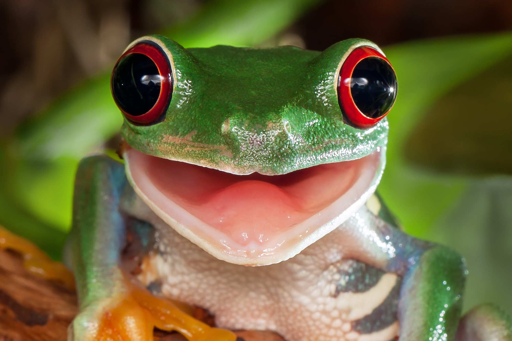

# CIFAR 10 Image Classification in Keras

<b> The CIFAR-10 dataset consists of 60000 32x32 colour images in 10 classes, with 6000 images per class. There are 50000 training images and 10000 test images </b>

<ul>
  <li>airplane</li>
  <li>automobile</li>
  <li>bird</li>
  <li>cat</li>
  <li>deer</li>
  <li>dog</li>
  <li>frog</li>
  <li>horse</li>
  <li>ship</li>
  <li>truck</li>
</ul>

<b> Model predicts an image that is one of 10 Classes with 80 percent accuracy </b>

  <i>Model Accuracy Plot</i>
  

     
  

  <i>Model Loss Plot</i>
  

     
  

--------------------------------------------------------------</>

<b>Example Model Result</b>

This is a Frog

 
